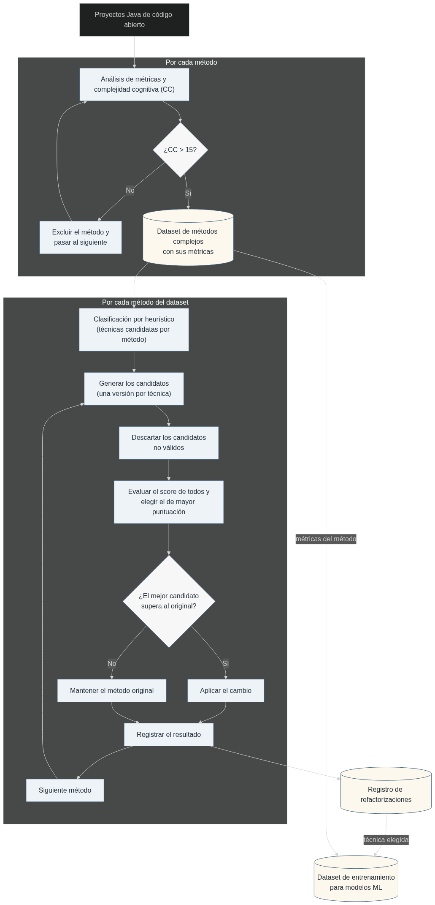

# TFM — Reducción automática de la complejidad cognitiva en código Java

Sistema de detección, clasificación y refactorización automática de métodos Java con complejidad cognitiva excesiva. Forma parte del Trabajo de Fin de Máster del Máster en Ingeniería del Software e Inteligencia Artificial (MISIA).

---

## Arquitectura del TFM

El proyecto se divide en dos fases:

1. **Detección y clasificación** *(implementada)*: el analizador AST (JavaParser) escanea los proyectos **localmente** (modo `scan`), detecta los métodos con `cognitive_complexity > 15` y extrae **19 métricas** por método, incluida la `cognitive_complexity` calculada localmente (ver [Complejidad cognitiva local](#complejidad-cognitiva-local)). Un clasificador determinista (`metrics_classifier.py`) aplica reglas sobre esas métricas para determinar qué técnica de refactorización corresponde. [Más sobre la evolución del enfoque de etiquetado →](docs/labeler-script.md#evolución-del-enfoque-de-etiquetado)
2. **Refactorización automática** *(implementada)*: un LLM aplica las técnicas recomendadas sobre **copias de trabajo** de los proyectos (ver `lib/workspace.py`). Para cada método con técnicas etiquetadas (1s en el dataset) se generan candidatos por técnica: el LLM produce el código, se aplica en la copia, se miden las métricas (CC, ciclomática, invocations) y se **deshace el cambio con git**. De todas las versiones se conserva la de mayor **score penalizado** `S = ΔCC − λ·max(0, ΔCyclo)` (empate → menor ciclomática; empate → aleatorio con semilla fija); solo se aplica y commitea si `S > 0`. En **Extract Method** la CC/Ciclomática del candidato es el **total = método principal + suma de los extraídos** (para no reducir la CC artificialmente). La ejecución puede hacerse en **paralelo** (`run_parallel.py`, un worker por grupo de proyectos, con reanudación). La localización de métodos se hace por **signatura** (`nombre + tipos de parámetros`), única dentro de una clase, porque tras un refactor las líneas cambian.



La detección y la métrica de complejidad son 100% locales, por lo que el **refactor iterativo puede ejecutarse sin SonarQube**. Las raíces de fuentes se detectan automáticamente: cada módulo (directorio con `pom.xml`, `build.gradle` o `build.xml`) aporta su `src/main/java` (o `src` para layouts Ant); se excluyen tests y directorios de build.

---

## Complejidad cognitiva local

La métrica `cognitive_complexity` se calcula **localmente** con JavaParser, replicando el algoritmo de **Cognitive Complexity** definido por **G. Ann Campbell** (SonarSource):

- **Especificación (white paper):** [Cognitive Complexity — G. Ann Campbell](https://www.sonarsource.com/docs/CognitiveComplexity.pdf)
- **Implementación de referencia:** `org.sonar.java.ast.visitors.CognitiveComplexityVisitor` del repositorio [sonar-java](https://github.com/SonarSource/sonar-java) (el motor de análisis Java de SonarQube). Se replica esta implementación, no solo la spec general, para que los valores coincidan con los que reporta SonarQube (regla `java:S3776`).

**En este proyecto:**

- **Archivo:** `ast-analyzer/src/main/java/com/tfm/astanalyzer/CognitiveComplexityVisitor.java`, un visitante del AST (`extends VoidVisitorAdapter<Void>`) con entry point `computeComplexity(CallableDeclaration<?>)`. Replica 1:1 la lógica de sonar-java (incremento por `nesting`, flag `ignoreNesting` para `else if`, flattening de operadores lógicos).
- **Reglas principales:**
  - `if` / `else if` / `else`, ternario, `for` / `foreach` / `while` / `do`, `switch`, `catch` → incremento por nivel de anidamiento (`+nesting`).
  - `&&` / `||` → `+1` por operador, colapsando operadores consecutivos del mismo tipo (`a && b && c` → +1; `a && b || c` → +2).
  - `break` / `continue` **etiquetados** → `+1` (un `break`/`continue` normal no cuenta).
  - Lambdas y clases internas/anónimas/enums/records → solo anidan (`+1` nesting).
  - El `try` no suma (solo cada `catch`); los `case` de un `switch` no suman; la recursión no suma (comportamiento de la implementación actual de sonar-java, que difiere de la spec general en estos puntos).
- **Uso:** la integra `ASTAnalyzer.analyzeMethod`, por lo que aparece como campo `cognitive_complexity` en el JSON de los modos por línea/signatura y en el modo `scan`. `main.py` la obtiene vía `lib/ast_analyzer.py` → `scan_project_complex_methods`.
- **Validación:** la CC local se validó contra la CC real de SonarQube de los 989 métodos del dataset original → **98.18% de coincidencia exacta**, lo que asegura la validez de la métrica.

---

## Estructura del proyecto

```
java-cognitive-refactor/
├── main.py                       # Pipeline principal (detección local → CSV)
├── refactor_loop.py              # Bucle de refactorización con LLM
├── run_parallel.py               # Lanzador paralelo (N workers, reanudación)
├── metrics_classifier.py         # Clasificador basado en reglas sobre métricas
│
├── lib/
│   ├── ast_analyzer.py           # Wrapper del analizador AST (Java)
│   ├── llm_client.py             # Cliente LLM OpenAI-compatible
│   └── workspace.py              # Copias de trabajo (out/) para refactor
│
├── ast-analyzer/                 # Módulo Java (Maven + JavaParser)
│   ├── pom.xml
│   ├── src/main/java/com/tfm/astanalyzer/
│   │   ├── ASTAnalyzer.java              # Análisis del AST (por línea/signatura/scan)
│   │   ├── CognitiveComplexityVisitor.java # CC local (replica de SonarSource)
│   │   └── MethodMetrics.java            # Contenedor de métricas
│   └── ast-analyzer.jar          # JAR generado con `mvn package` (no versionado)
│
├── analysis/
│   ├── compare_models.py           # Comparación ML vs etiquetado (experimentos)
│   └── output/                     # Resultados de los análisis (no versionado)
│
├── data/
│   ├── aggregate_method_data.py  # Script de consolidación de CSVs
│   ├── aggregated_method_data.csv
│   ├── final_methods_dataset_*.csv
│   ├── refactor_log*.jsonl       # Logs de las ejecuciones (no versionados)
│   └── run_parallel.cmd          # Lanzador de ejecución paralela (ventana)
│
├── docs/
│   ├── ast-metrics.md            # Documentación de métricas extraídas
│   └── labeler-script.md         # Documentación del script de etiquetado
│
├── Graficas/                     # Gráficas de resultados (CC/cyclo por técnica y λ)
├── projects/                     # Código fuente de proyectos analizados
├── requirements.txt
├── .env                          # Variables de entorno (no versionado)
├── .env.example                  # Plantilla de variables de entorno
├── .gitignore
└── README.md
```

---

## Requisitos

- **Python 3.10+** con las dependencias de `requirements.txt`:
  ```bash
  pip install -r requirements.txt
  ```
- **Java 17+** para ejecutar `ast-analyzer.jar`.

---

## Configuración

Copia `.env.example` a `.env` y rellena los valores:

```env
PROJECTS_DIR=projects
DATA_DIR=data
CC_THRESHOLD=15
WORK_DIR=out
REFACTOR_CYCLO_PENALTY=1
REFACTOR_MAX_CYCLO_DELTA_PCT=0
REFACTOR_SEED=42
REFACTOR_MAX_TOKENS=24000
REFACTOR_MODE=stream
REFACTOR_BATCH_MAX_TOKENS=100000
REFACTOR_BATCH_TIMEOUT=600
REFACTOR_BATCH_RETRIES=2
REFACTOR_RUN_TESTS=never
LLM_BASE_URL=https://opencode.ai/zen/go/v1
LLM_API_KEY=your_api_key_here
LLM_MODEL=deepseek-v4-flash
LLM_TEMPERATURE=0.2
LLM_MAX_TOKENS=2048
LLM_TIMEOUT=120
LLM_REASONING_EFFORT=high
```

Las claves `LLM_*` configuran el cliente OpenAI-compatible (`lib/llm_client.py`) usado en la fase de refactorización con LLM: `LLM_BASE_URL` y `LLM_API_KEY` cambian según el proveedor (OpenAI, OpenRouter, Ollama, OpenCode Go…); `LLM_MODEL` es el nombre del modelo. `LLM_REASONING_EFFORT` (p.ej. `high`/`low` en DeepSeek V4) fija el esfuerzo de razonamiento de los modelos con *thinking*; si se deja vacío, no se envía el parámetro.

`WORK_DIR` es el directorio donde se crean las **copias de trabajo** (clones locales) de los proyectos para refactorizar sin tocar `projects/` (ver `lib/workspace.py`).

La selección de la mejor versión refactorizada usa un **score con penalización** de la ciclomática:

$$S(c) = \Delta CC(c) - \lambda \cdot \max\big(0,\ \Delta Cyclo(c)\big)$$

`REFACTOR_CYCLO_PENALTY` es `λ` (default `1`; `0` = seleccionar solo por CC). Se elige el candidato de mayor `S` y solo se aplica si `S > 0` (si no, se mantiene el original). `REFACTOR_MAX_CYCLO_DELTA_PCT` queda como **red de seguridad opcional** (`0` = desactivado). Se controlan junto a `CC_THRESHOLD` (complejidad cognitiva). `REFACTOR_MAX_TOKENS` fija el máx. de tokens de salida por llamada en el refactor (default `24000`; los métodos grandes necesitan más que `LLM_MAX_TOKENS`). Las fórmulas están documentadas en la nota Semana 10 (Obsidian).

En **Extract Method**, la CC/Ciclomática del candidato se mide como **total = método principal + suma de los métodos extraídos** (si solo se midiera el principal, extraer lógica a sub-métodos reduciría la CC artificialmente). Así, la extracción solo se acepta si el total mejora al original.

`REFACTOR_MODE` elige cómo se hacen las llamadas LLM: `stream` (default) hace **una llamada por técnica y método**; `batch` agrupa varios métodos en **una sola llamada** (JSON: entrada `{"methods":[{id, signature, techniques, source}]}` → salida `{"refactors":[{id, technique, main_method, new_methods}]}`) y luego evalúa cada candidato con los mismos criterios (`select_best`, log). En batch, los métodos que fallan (no parsean, JSON inválido, ausentes) se **reintentan en rondas dirigidas** (`REFACTOR_BATCH_RETRIES`, default 2) reenviando solo esos métodos con el **error exacto** (Parse/Lexical) como feedback al LLM para que lo corrijan; si un lote entero falla, se parte por la mitad y se reintenta. `REFACTOR_BATCH_MAX_TOKENS` es el presupuesto de **salida** por llamada (default `100000`; DeepSeek V4 Flash permite hasta ~384k, así que cada llamada puede llevar decenas de métodos) y `REFACTOR_BATCH_TIMEOUT` es la guardia de reloj mínima (default `600`s), adaptativa al tamaño del lote. Las llamadas del batch usan **streaming** (el gateway cierra las respuestas no-streaming que tardan demasiado) con guardia de reloj para no quedarse colgado en streams silenciosos.

> **⚠️ Verificación de tests — experimental.** Con `REFACTOR_RUN_TESTS=auto/always` el bucle cronometra la suite de tests del proyecto antes y después del pase. Es una funcionalidad **experimental**: puede no funcionar en algunos proyectos (submódulos, dependencias no resueltas, tiempos de compilación excesivos o ausencia de build tool). Los refactors se validan siempre por **parseo** (JavaParser); la ejecución de tests no es necesaria para el funcionamiento del resto del pipeline.

---

## Uso

**Flujo completo:** (1) detectar y etiquetar los métodos (`main.py` + `metrics_classifier.py`), (2) refactorizarlos con LLM (`refactor_loop.py` o `run_parallel.py`), (3) generar el dataset de entrenamiento desde el log (`data/build_refactor_dataset.py`).

### 1. Pipeline completo (detección local → AST → CSV)

```bash
cd java-cognitive-refactor/
python main.py
```

Recorre todos los proyectos en `projects/`, detecta localmente los métodos con `cognitive_complexity > CC_THRESHOLD` (por defecto 15) y genera los CSV individuales en `data/`.

### 2. Consolidar CSVs individuales en uno agregado

```bash
python data/aggregate_method_data.py
```

Genera `data/aggregated_method_data.csv` a partir de todos los `final_methods_dataset_*.csv`.

### 3. Clasificador por reglas (métricas del CSV)

```bash
python metrics_classifier.py
```

Aplica reglas deterministas sobre las métricas del CSV para predecir refactorizaciones. El CSV de salida se guarda en `analysis/output/`.

### 4. Bucle de refactorización con LLM

```bash
python refactor_loop.py [--project <proyecto>] [--limit N] [--dry-run]
```

Crea copias de trabajo de los proyectos (`WORK_DIR`, default `out/`) y, para cada método del dataset con técnicas etiquetadas, intenta cada técnica con el LLM: aplica → mide (CC, ciclomática, invocations) → **deshace con git**. La mejor versión se elige por el **score penalizado** `S = ΔCC − λ·max(0, ΔCyclo)` (ver [Configuración](#configuración)): solo se aplica y commitea si `S > 0`, si no se mantiene el original. `--dry-run` no deja cambios ni commits. El detalle de cada intento (con su score) se registra en `data/refactor_log.jsonl`. Config: `WORK_DIR`, `CC_THRESHOLD`, `REFACTOR_CYCLO_PENALTY`, `REFACTOR_MAX_CYCLO_DELTA_PCT` (0 = sin límite), `REFACTOR_SEED`, `REFACTOR_RUN_TESTS` (`never`/`auto`/`always`, cronometra la suite de tests del proyecto antes/después del pase). Ver [Modo batch](#modo-batch) y [Ejecución paralela](#ejecución-paralela).

#### Modo batch

`REFACTOR_MODE=batch` agrupa varios métodos en **una sola llamada LLM** (JSON) y luego evalúa cada candidato con los mismos criterios que en stream (ver [Configuración](#configuración)). `REFACTOR_BATCH_MAX_TOKENS` controla el tamaño del lote y `REFACTOR_BATCH_TIMEOUT` su timeout; las llamadas del batch usan streaming.

#### Ejecución paralela

```bash
python run_parallel.py -n 4              # ejecución completa con 4 workers
python run_parallel.py -n 4 --fresh      # ignora reanudación
python run_parallel.py -n 3 --dry-run --limit 4   # prueba rápida
python run_parallel.py -n 2 --resume data/resume.jsonl   # reanuda desde otro log
```

Reparte los proyectos entre N workers (cada proyecto lo procesa un solo worker, cada worker con su propio workspace y su propio log, y un `OPENCODE_SESSION_ID` distinto). Al terminar fusiona los logs parciales en `data/refactor_log.jsonl`; la reanudación se lee de ese log principal (o del indicado con `--resume`). El arranque de cada worker solo clona/restaura **sus** proyectos, para no pisar a los demás.

### 5. Escanear un proyecto (detección local) y analizar por signatura

```bash
# Escaneo local: métodos con cognitive_complexity > umbral (15 por defecto)
java -jar ast-analyzer/ast-analyzer.jar scan <raiz_proyecto> [umbral]

# Por línea (legado)
java -jar ast-analyzer/ast-analyzer.jar <archivo.java> <linea>

# Por signatura: nombre + tipos de parámetros (único dentro de una clase)
java -jar ast-analyzer/ast-analyzer.jar <archivo.java> "nombreMetodo(int, java.lang.String)"

# Por signatura con clase contenedora (si hay varias clases en el archivo)
java -jar ast-analyzer/ast-analyzer.jar <archivo.java> "MiClase.nombreMetodo(int)"
```

La búsqueda por signatura es necesaria en el refactor iterativo: tras editar el archivo, las líneas cambian pero la signatura se mantiene.

### 6. Dataset de entrenamiento desde el log

```bash
python data/build_refactor_dataset.py --log data/refactor_log_lambda_05.jsonl \
    --out data/refactor_training_dataset_lambda_05.csv
```

A partir del log de una ejecución genera un CSV consolidado (con columna `project`) en el que cada método del dataset **original** conserva sus métricas y las columnas de técnica tienen **un único `1`** en la técnica que el bucle escogió de verdad (el refactor aplicado, del `status=kept` del log); el resto va a 0 y los métodos no refactorizados quedan con todo a 0. No usa el heurístico: el `1` refleja la técnica ganadora según el score. Listo para entrenar modelos ML que predigan la técnica más adecuada.

---

## Técnicas de refactorización evaluadas

El proyecto etiqueta cada método con hasta 2 de las siguientes 5 técnicas:

| Técnica | Columna en el CSV |
|---|---|
| Extract Method | `refactor_extract_method` |
| Collapse nested ifs with `&&` | `refactor_collapse_ifs_with_and` |
| Lambda Map (`stream().map()`) | `refactor_lambda_map` |
| Lambda Filter + Map (`stream().filter().map()`) | `refactor_lambda_filter_map` |
| Lambda Reduce (`stream().reduce()`) | `refactor_lambda_reduce` |

Cada columna contiene `1` si la técnica es aplicable o `0` si no lo es.

La documentación detallada de las reglas de clasificación y el funcionamiento de `metrics_classifier.py` está en [docs/labeler-script.md](docs/labeler-script.md).

---

## Resultados

Tres ejecuciones completas sobre el dataset (988 métodos) variando el parámetro de penalización de ciclomática `λ` del score `S = ΔCC − λ·max(0, ΔCyclo)`:

| λ | Reducción CC global | Reducción Cyclo global | Métodos refactorizados | keep_original |
|---|---|---|---|---|
| 0 | **−21.6%** | −4.7% | 415 | 196 |
| 0.5 | −21.2% | −7.7% | 341 | 270 |
| 1 | −21.5% | **−8.8%** | 333 | 278 |

Al subir `λ` la ciclomática mejora progresivamente (−4.7% → −7.7% → −8.8%) manteniendo la reducción de complejidad cognitiva alrededor del −21%. La CC de cada candidato (y la ciclomática en Extract Method) se mide como **total efectivo** (método principal + métodos extraídos), por lo que la reducción no es artificial. Las gráficas por técnica y λ están en `Graficas/`. Los logs de cada ejecución (`data/refactor_log_lambda_{0,05,1}.jsonl`) registran por método: técnica, CC/ciclomática base y candidata, score, tokens y decisión.

---

## Compilación del analizador

El JAR `ast-analyzer/ast-analyzer.jar` no se versiona; se genera con Maven:

```bash
cd ast-analyzer/
mvn package
copy target\ast-analyzer.jar ast-analyzer.jar
```

Tras modificar el analizador, reconstruye el JAR y vuelve a ejecutar el pipeline para regenerar los CSVs:

```bash
cd ..
python main.py
python data/aggregate_method_data.py
```

---

## Métricas del dataset

El dataset agregado contiene 26 columnas: 5 de identificación (`file`, `method_name`, `method_start_line`, `method_end_line`, `cognitive_complexity`), 16 métricas estructurales extraídas del AST, y 5 columnas de refactorización.

El analizador AST devuelve 19 métricas por método: las 18 estructurales más `cognitive_complexity` (calculada localmente replicando el algoritmo de Cognitive Complexity de SonarSource; ver [Complejidad cognitiva local](#complejidad-cognitiva-local)). Entre las estructurales se incluyen la `cyclomatic_complexity` (McCabe) y `method_invocations` (proxy de trabajo), útiles para medir el impacto del refactor en otras métricas. Además, incluye `method_signature` (nombre + tipos de parámetros) y `enclosing_class` (clase contenedora), necesarias para localizar métodos por signatura tras un refactor.

La documentación detallada de cada métrica está en [docs/ast-metrics.md](docs/ast-metrics.md).
